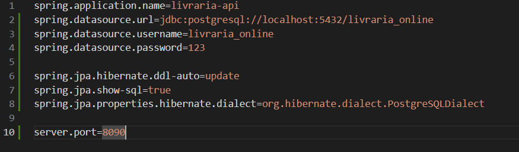
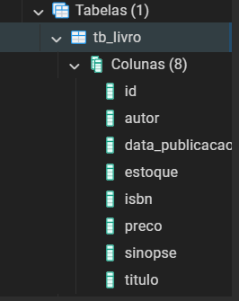

# Biblioteca-Virtual
Criando uma Biblioteca com SpringBoot/java

<h1> Criando o Back End</h1>

<h2> Criando o Projeto no Spring Initialzr</h2>
 <p> Para esse projeto usarei a versão mais estável do springboot(3.3.3).<br>
  Escolhi a linguagem Java e o projeto será Maven.
 </p>
 <p>Irei trabalhar com o banco de dados PostgreeSQL.<br> Essas serão as dependências utilizadas:
 
 - Spring Web - Para criar uma api rest.
 - Spring Data JPA - Para integrar a Java Persistence API ao banco de dados.
 - PostgreSQL Driver - Para conctar ao PostgreSQL.
 - Spring Boot DevTools - para facilitar o desenvolvimento.
 </p>
<h2> Mapeamento  das Entidades</h2>

``` mermaid 
classDiagram
  class Livro {
    -Long id
    -String titulo
    -String sinopse
    -String ISBN
    -BigDecimal preco
    -List~Estoque~ estoques
    -Editora editora
    -List~Autor~ autores
    -Categoria categoria
  }

  class Estoque {
    -Long id
    -int quantidadeDisponivel
  }

  class Editora {
    -Long id
    -String nome
  }

  class Autor {
    -Long id
    -String nome
  }

  class Categoria {
    -Long id
    -String nome
  }

  class Usuario {
    -Long id
    -String nome
    -String email
    -String senha
    -List~Endereco~ enderecos
    -List~Pedido~ pedidos
  }

  class Endereco {
    -Long id
    -String rua
    -String numero
    -String complemento
    -String cidade
    -String estado
    -String cep
  }

  class Pedido {
    -Long id
    -List~Livro~ itens
    -Endereco endereco
    -Pagamento pagamento
    -String status
    -LocalDate dataPedido
    -BigDecimal total
    -Usuario usuario
  }

  class Pagamento {
    -Long id
    -String statusPagamento
    -MetodoPagamento metodoPagamento
  }

  class MetodoPagamento {
    -Long id
    -String nome
    -String descricao
  }

  Livro "N" *-- "1" Editora
  Livro "N" *-- "N" Autor
  Livro "N" *-- "1" Categoria
  Livro "1" *-- "N" Estoque
  Usuario "1" *-- "N" Pedido
  Usuario "1" *-- "N" Endereco  
  Pedido "N" *-- "N" Livro     
  Endereco "1" *-- "N" Pedido 
  Pedido "1" *-- "1" Pagamento
  Pagamento "1" *-- "1" MetodoPagamento
 ```
 <h2>Criando as entidades </h2>
 <h3>Livro</h3>
A classe Livro, representa a entidade de um livro no sistema de uma livraria. A classe é mapeada para a tabela tb_livro no banco de dados através da anotação @Entity. Cada livro possui vários atributos, incluindo id (identificador único), titulo, autor, isbn, dataPublicacao, preco, estoque, e uma sinopse. Os atributos são armazenados no banco de dados com validações de não nulidade e alguns possuem tipos específicos, como BigDecimal para o preço e LocalDate para a data de publicação. A classe também inclui construtores, getters e setters para acessar e modificar os valores dos atributos.

<h2>Repositorio</h2>

<h3>A interface LivroRepository</h3>
 é um repositório responsável por realizar operações de banco de dados para a entidade Livro. Ele estende a interface JpaRepository, fornecendo métodos padrão para operações como salvar, atualizar, deletar e buscar livros. Além disso, inclui um método personalizado existsByIsbn(String isbn), que verifica se já existe um livro cadastrado com um determinado ISBN no banco de dados. A anotação @Repository indica que é um componente de persistência Spring.

<h2>Implementação</h2>

A camada de implementação de serviço (ServiceImpl) é responsável por executar a lógica de negócios da aplicação, interagindo diretamente com o repositório de dados. No caso da livraria, a implementação do serviço de Livro define métodos para:

Criar Livros: Antes de salvar um novo livro, verifica se o ISBN já está cadastrado no banco de dados, evitando duplicidade.
Buscar por ID: Retorna um livro com base no ID, lançando uma exceção se o livro não for encontrado.
Essa camada abstrai a complexidade do acesso ao banco de dados e mantém a lógica de negócios centralizada.

<h2>Controller</h2>

Buscar Livro por ID:

Método: findById(@PathVariable Long id)
Descrição: Recebe uma requisição GET para buscar um livro específico pelo seu ID. Utiliza o serviço LivroService para obter o livro e retorna uma resposta HTTP 200 (OK) com o livro encontrado.
Criar Novo Livro:

Método: create(@RequestBody Livro livroToCreate)
Descrição: Recebe uma requisição POST para criar um novo livro com base nos dados fornecidos no corpo da requisição. Utiliza o serviço LivroService para salvar o novo livro e retorna uma resposta HTTP 201 (Created) com a localização do novo recurso, além dos dados do livro criado.
Essas operações são implementadas utilizando anotações do Spring para definir as rotas e tratar as requisições HTTP.

<h2>Conectando ao PostGreSQL</h2>
Configuração do application.properties:
 
 
 

 Tabela Criada no Postgre:

 